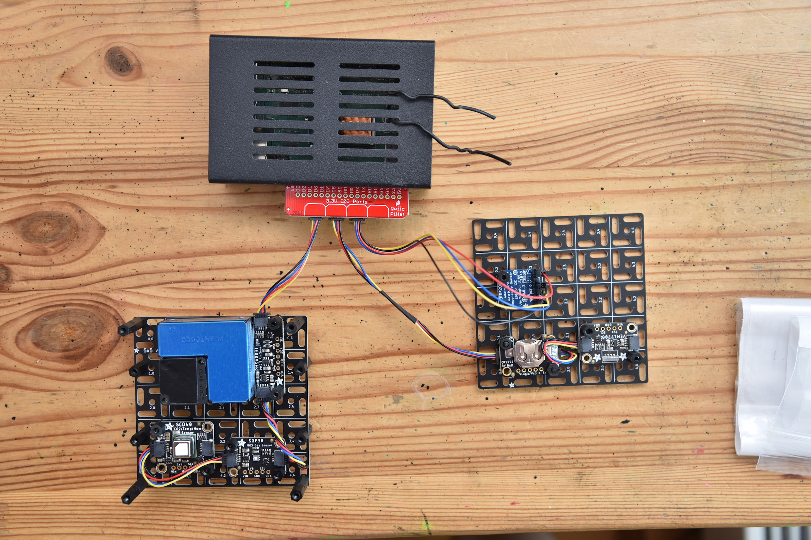
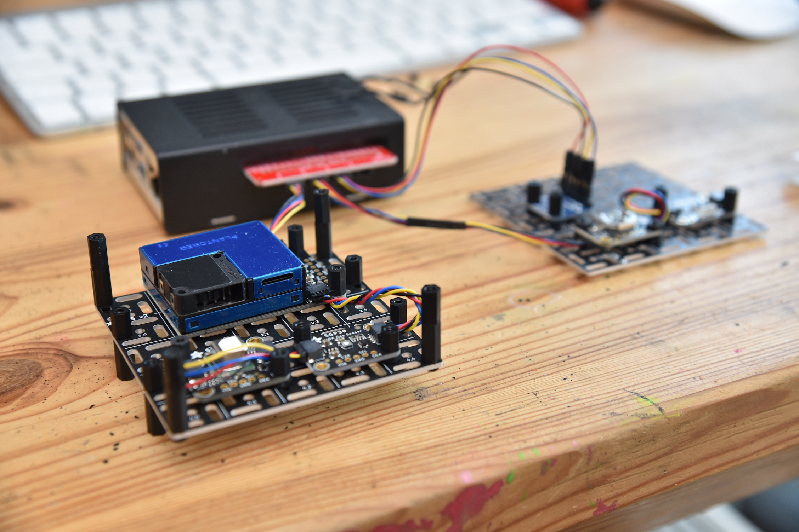
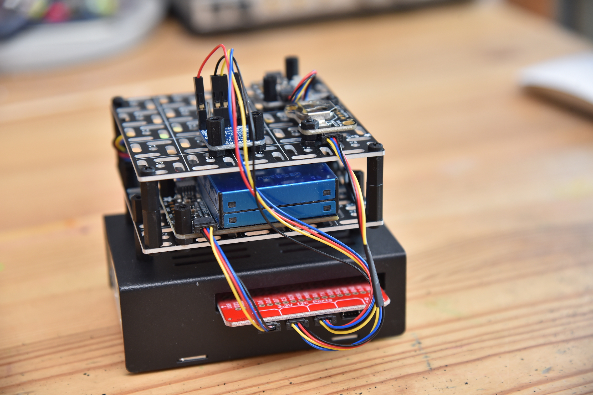
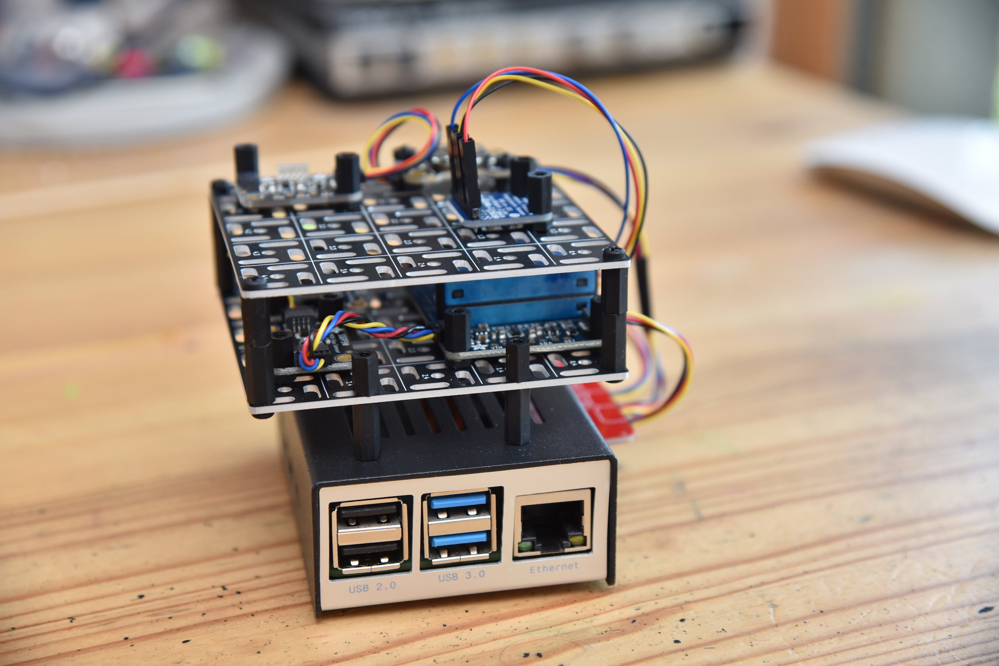
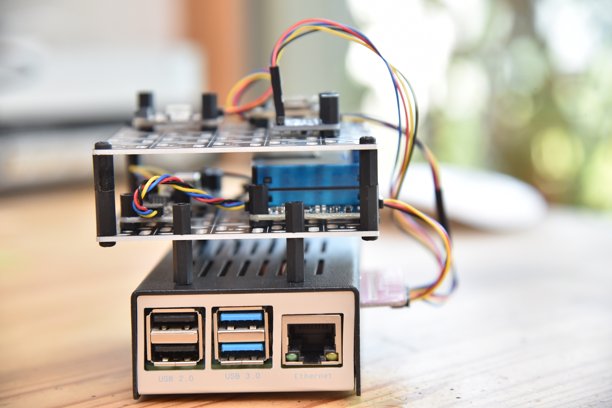

[](https://github.com/vladak/weather/actions/workflows/python-checks.yml)

# Weather

Mostly indoors weather/environment monitoring station based on:
  - Raspberry Pi + Raspbian
  - sensors
  - Python
  - [Prometheus](https://prometheus.io/)
  - [Grafana](https://grafana.com/)

The goals are:
  - Grafana dashboard for the collected metrics
  - flexible alerting (audible/via app) for thresholds of some of the metrics

Also, the metrics should be available for displaying on external display ala [eInk display with Rpi](https://github.com/vladak/zerodisplay).

## Sensors

These metrics are collected:

| *Metric* |                                  *Sensor*                                   | *Sensor connection* | *Metric access* |
| ------------- |:---------------------------------------------------------------------------:| :-------------: | :-------------: |
| [temperature](https://en.wikipedia.org/wiki/Temperature) | [DS18B20](https://www.maximintegrated.com/en/products/sensors/DS18B20.html) | [1-Wire](https://en.wikipedia.org/wiki/1-Wire) (via [DS9490R](https://www.maximintegrated.com/en/products/interface/universal-serial-bus/DS9490.html)) | [OWFS](https://www.owfs.org/) |
| [barometric pressure](https://en.wikipedia.org/wiki/Atmospheric_pressure) |          [Adafruit BMP280](https://www.adafruit.com/product/2651)           | [I2C](https://en.wikipedia.org/wiki/I%C2%B2C) | [Python libraries](https://github.com/adafruit/Adafruit_CircuitPython_BMP280) |
| [CO2](https://en.wikipedia.org/wiki/Carbon_dioxide) and [humidity](https://en.wikipedia.org/wiki/Humidity) |          [Adafruit SCD-40](https://www.adafruit.com/product/5187)           | [I2C](https://en.wikipedia.org/wiki/I%C2%B2C) | [Python libraries](https://github.com/adafruit/Adafruit_CircuitPython_SCD4x) |
| [air particles](https://en.wikipedia.org/wiki/Particulates) |         [Adafruit PMSA003I](https://www.adafruit.com/product/4632)          | [I2C](https://en.wikipedia.org/wiki/I%C2%B2C) | [Python libraries]( https://github.com/adafruit/Adafruit_CircuitPython_PM25) |
| light in [Lux](https://en.wikipedia.org/wiki/Lux) |         [Adafruit VEML7700](https://www.adafruit.com/product/4162)          | [I2C](https://en.wikipedia.org/wiki/I%C2%B2C) | [Python libraries](https://github.com/adafruit/Adafruit_CircuitPython_VEML7700) |
| [TVOC](https://en.wikipedia.org/wiki/Volatile_organic_compound#Indoor_VOCs) |          [Adafruit ENS160](https://www.adafruit.com/product/5606)           | [I2C](https://en.wikipedia.org/wiki/I%C2%B2C) | [Python libraries](https://github.com/adafruit/Adafruit_CircuitPython_SGP30) |

The I2C sensors are connected to the [Raspberry Pi](https://www.raspberrypi.org/) via the [SparkFun Qwiic / STEMMA QT HAT](https://www.adafruit.com/product/4688) that offers 4 [Stemma Qt](https://learn.adafruit.com/introducing-adafruit-stemma-qt/what-is-stemma-qt) ports.

## Physical packaging

For a long time I had the sensors dangling from the Raspberri Pi on the side of a bookshelf (which arguably placed the sensors in good environment for taking measurements),
some of them placed into modded plastic SD card enclosure or even the plastic egg found in Kinder surprise. I knew there ought to be a way how to neatly stack them,
playing around with ideas like using LEGO or maybe custom 3D printed enclosure until I found the congenial [Aluminum Mounting Grid](https://www.adafruit.com/product/5779).

Currently there are 2 floors. Each of the sensors is attached so that the metal parts do not touch the mounting grid (using small plastic nut and screws found in the [kit](https://www.adafruit.com/product/3299)).

The mounting grids are fastened to the Pi enclosure with a coated metal wire.

I will yet see how this fares w.r.t. thermal regulation impacting the measurements. All the temperature sensors are not on the metal grids so that's okay.







## Setup

### I2C

- enable I2C via `sudo raspi-config`
  - it is under `Interface Options`
- verify I2C bus presence via `sudo i2cdetect -l`
  - should report something like this: `i2c-1	i2c       	bcm2835 (i2c@7e804000)          	I2C adapter`

### OWFS

- needs OWFS system package:
```
  sudo apt-get -y install owfs
```
- change `/etc/owfs.conf` to contain the following line and comment about any
  lines with `FAKE` sensors
```
server: usb = all
```
and restart the service:
```
sudo systemctl restart owfs
```

Initially this was not working and the `owfs` service complained about no bus
being seen. `apt-get update && apt-get upgrade` pulled bunch of raspberrypi
kernel updates and after reboot the sensors were available under the `/run/owfs`
directory.


## Install the weather service

This is a simple Python program that collects the metrics and presents them via 
[Prometheus web server](https://github.com/prometheus/client_python) so they
can be scraped by Prometheus.

- clone the repository to `/srv/weather/`:
```
  git clone https://github.com/vladak/weather.git /srv/weather
```
- install pre-requisites:
```
sudo apt-get -y install  python3-venv
# needed for bmp280 Python package (it needs to compile stuff)
sudo apt-get install python3-dev
```
- install requirements
```
  cd /srv/weather
  python3 -m venv env
  . ./env/bin/activate
  pip install -r requirements.txt
```
- create `/srv/weather/weather.ini` configuration file:
```
[temp_sensors]
21F723030000 = terasa
D5F2CF020000 = kuchyne

[global]
# Use name of the sensors from the 'temp_sensors' section.
outside_temp_name = terasa/shield
inside_temp_name = kuchyne
# altitude (in meters) for computing atmospheric pressure at sea level
altitude = 245
# Overrids the --loglevel command line option
# loglevel = debug
```
- add the `weather` service
```
  sudo cp weather.service /etc/systemd/system/
  sudo systemctl enable weather
  # if the file /etc/systemd/system/weather.service changes, run:
  sudo systemctl daemon-reload
  # start the service:
  sudo systemctl start weather
  sudo systemctl status weather
```
Check the metrics:
```
curl http://localhost:8111
```

## Prometheus

- install Prometheus (standalone, i.e. not via Docker)
```
  TBD
  sudo systemctl enable prometheus
  sudo systemctl start prometheus
```
- add the weather app to `/etc/prometheus/prometheus.yml`:
```yml
scrape_configs:
  # ...

  - job_name: weather
    static_configs:
      - targets: ['localhost:8111']
```

## Grafana

- install Grafana (standalone, i.e. not via Docker))
- provision the dashboards from the `.json` files in the `grafana/provisioning/dashboards` directory
- setup Alert notification channels (set both as _Default_):
  - [PagerDuty](https://www.pagerduty.com/)
  - `localhost:8333` (for the _Alert handler_ below)

The Weather dashboard looks like this:


In the graphs one can see the CO2 metric above the threshold. This generated an alert.

### Alert handler

The goal is to play a sound when Grafana produces an alert that matches certain criteria,
e.g. when the CO2 metric rises above given level (time to open a window).

- connect the [USB speaker](https://www.adafruit.com/product/3369)
- create `/etc/modprobe.d/alsa.conf` with the following content to make sure the USB audio card does not change Alsa slots on reboot:
```
options snd slots=snd-bcm2835,vc4,vc4,snd-usb-audio
```
- reboot
- install pre-requisites:
```
  sudo apt-get install -y mpg123
```
- get the list of Alsa devices:
```
   aplay -l
```
  - the USB speaker should show up as:
```
card 3: UACDemoV10 [UACDemoV1.0], device 0: USB Audio [USB Audio]
  Subdevices: 1/1
  Subdevice #0: subdevice #0
```
- setup sound card in Alsa config (using the device index from `aplay -l`):
```
  sudo sed -i /usr/share/alsa/alsa.conf \
      -e 's/^defaults.ctl.card 0/defaults.ctl.card 3/' \
      -e 's/^defaults.pcm.card 0/defaults.pcm.card 3/'
```
- copy some MP3 files (with `.mp3` suffix) to `/srv/weather/`
- create configuration in `musicalert.ini` like so:
```
[global]
# allows to override the --loglevel command line option
loglevel = debug

[mp3match]
# Rules to match mp3 files to play. The key is the file name,
# the value is either a string to exact match the alert name
# or a list to exact match the alert name and regexp match the
# 'valueString' value in the alert. This is handy to have different
# files matching the same alert name but different payload. 
#
# All the files in this section have to readable.
"foo.mp3" = "Foo foo"
"Bar.mp3" = ["Bar bar", ".*Bar.*"] 

# This section is optional, the defaults are 8 and 23.
# The mp3 file will not be played outside of this range.
[start_end]
start_hr = 10
end_hr = 20
```
- test the alert in Grafana (it should start playing the MP3 file)
  - run:
  ```
  cd /srv/weather
  . ./env/bin/activate
  ./musicalert.py -l debug
  ```
  - go to Alerts -> Notification channels and hit 'Test'
  - a mp3 should be played
- install the service
```
  sudo cp /srv/weather/musicalert.service /etc/systemd/system/
  sudo systemctl enable musicalert
  sudo systemctl daemon-reload
  sudo systemctl start musicalert
  systemctl status musicalert
```

## Links

### Guides

- SCD-40 guide: https://learn.adafruit.com/adafruit-scd-40-and-scd-41/python-circuitpython
- PMSA003I guide: https://github.com/adafruit/Adafruit_CircuitPython_PM25
- USB card with Raspberry Pi: https://learn.adafruit.com/usb-audio-cards-with-a-raspberry-pi/updating-alsa-config
- [BMP280](https://www.adafruit.com/product/2651) guide: https://learn.adafruit.com/adafruit-bmp280-barometric-pressure-plus-temperature-sensor-breakout/circuitpython-test
- VEML7700 guide: https://learn.adafruit.com/adafruit-veml7700
- ENS160 guide: https://learn.adafruit.com/adafruit-ens160-mox-gas-sensor/circuitpython-python
- SGP30 guide: https://learn.adafruit.com/adafruit-sgp30-gas-tvoc-eco2-mox-sensor/circuitpython-wiring-test

## Lessons learned

- with brand new ENS160 sensor (powered for the first time) it is necessary to wait for multiple hours before it is ready to use: https://forums.adafruit.com/viewtopic.php?p=1047569#p1047569
